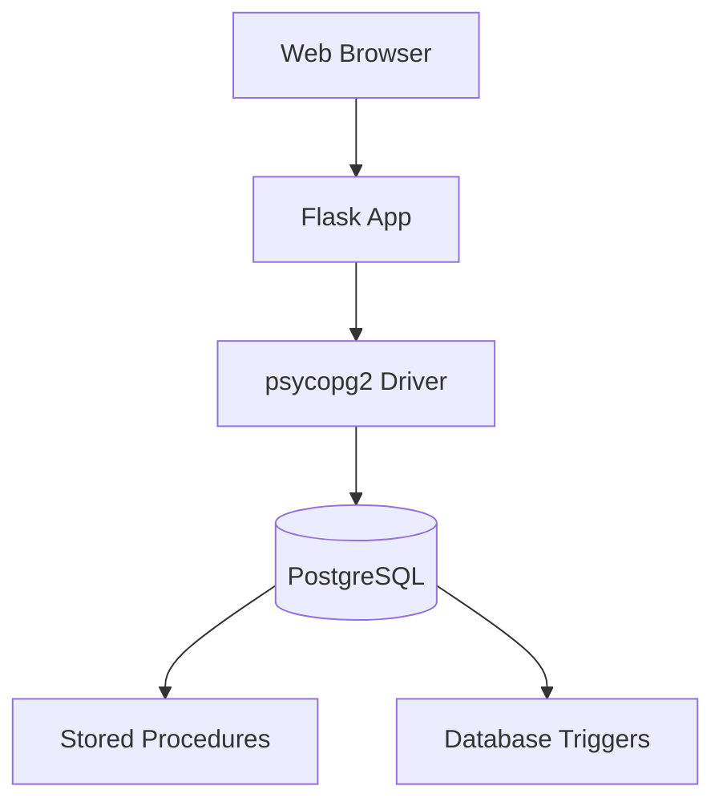

# Integrated Fest Management System (DBMS)


A feature-complete event management ecosystem professionally engineered with a robust PostgreSQL backend. This system automates the lifecycle of university or corporate festivals, managing multi-role interactions—including Participants, Organizers, Sponsors, and Performers—using complex transactional logic, database triggers, and stored procedures for guaranteed data integrity.

## Table of Contents
- [Tech Stack & Architecture](#tech-stack--architecture)
- [Prerequisites](#prerequisites)
- [Installation & Local Setup](#installation--local-setup)
- [Usage & Running the App](#usage--running-the-app)
- [Testing](#testing)
- [Deployment](#deployment)
- [Contributing Guidelines](#contributing-guidelines)
- [License and Contact](#license-and-contact)

## Tech Stack & Architecture

### Core Technologies
- **Backend API**: `Flask` (Python-based web routing)
- **Database Engine**: `PostgreSQL` (Relational data storage)
- **Interface**: `HTML5 / CSS3` (via Jinja2 templates)
- **Driver**: `psycopg2` (PostgreSQL adapter for Python)

### High-Level Architecture
The system utilizes a client-server architecture with a heavy emphasis on database-level logic:
- **`newapp.py`**: The central application controller managing user sessions, multi-role routing, and SQL execution.
- **Stored Procedures & Functions**: Complex queries (e.g., `total_profit_from_fest`) are offloaded to specialized PostgreSQL functions for performance.
- **Triggers**: Automated integrity checks (e.g., registration limits) are enforced natively via PL/pgSQL triggers.
- **RBAC (Role-Based Access Control)**: Strictly defines access levels for Administrators, Sponsors, and Participants.



## Prerequisites
- **Python**: v3.8+
- **PostgreSQL**: Local instance running on port 5432.
- **Database Tools**: `psql` or `pgAdmin` recommended for schema initialization.

## Installation & Local Setup

### 1. Database Initialization
Create the database and execute the foundational SQL scripts in order:
```bash
createdb Fest_Management
psql -d Fest_Management -f "Create Functions"
psql -d Fest_Management -f "Fereign key Constraints"
psql -d Fest_Management -f "Triggers"
psql -d Fest_Management -f "Fest Management Sample data"
```

### 2. Application Setup
```bash
git clone https://github.com/Devansh-Kesan/Fest-Management-System-DBMS-Project.git
cd Fest-Management-System-DBMS-Project
pip install -r requirements.txt # Or install flask and psycopg2-binary
```

## Usage & Running the App

### Start the Management Console
Initialize the Flask development server:
```bash
python newapp.py
```
By default, the application runs on **`http://127.0.0.1:5000`**.

### Login Credentials (Sample)
- **Admin**: `username: admin`, `password: admin123`
- **Sponsor**: `username: Sponsor1`, `password: pass123`

## Testing
- **Manual Verification**: Utilize the `Extra functions` SQL scripts to verify profit calculations and concurrent registration logic.
- **Integrity Checks**: Verify that foreign key constraints and triggers prevent over-booking or inconsistent sponsor contributions.

## Deployment
For production hosting, migrate the PostgreSQL schema to a cloud-managed RDS instance and wrap the Flask app with `Gunicorn` and an `Nginx` reverse proxy.

## Contributing Guidelines
1. Branch from `master`.
2. Ensure all SQL modifications include a corresponding migration script.
3. Maintain **PEP-8** formatting in `newapp.py`.
4. Provide unit tests for new database functions if applicable.

## License and Contact
- **License**: MIT
- **Contact**: Devansh Kesan (https://github.com/Devansh-Kesan)
